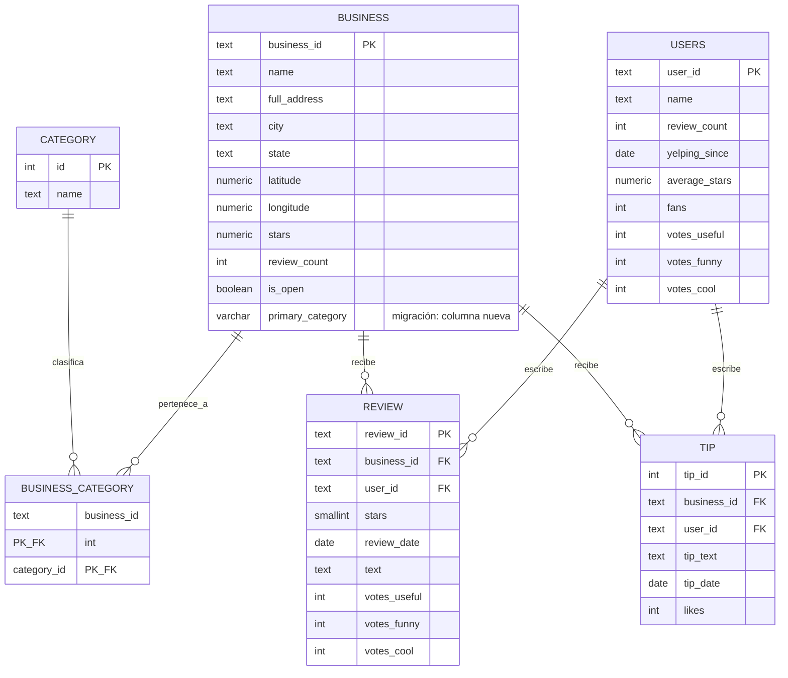

# Dominio de negocio — Reseñas de negocios locales (Goodyear, AZ)

## 1. Descripción del dominio

El modelo representa una **plataforma de reseñas de negocios locales**, inspirada en el
caso real de Yelp: negocios que pueden pertenecer a varias categorías (restaurante,
tienda, servicio de salud...), publican su horario de atención, y reciben **reseñas**
(calificación + texto) y **tips** (recomendaciones cortas, sin calificación) de parte
de **usuarios** registrados. Además, cada negocio acumula un historial agregado de
**check-ins**: cuántas visitas se registraron en cada franja de hora/día de la semana,
útil para entender patrones de afluencia.

A diferencia de Parch & Posey (una empresa que vende *a* cuentas corporativas a través
de representantes de ventas), este dominio es de **consumo masivo**: miles de usuarios
individuales interactúan libremente con cientos de negocios, sin jerarquía de ventas ni
territorios. La pregunta de negocio típica no es "¿qué representante vendió más?", sino
cosas como "¿qué categoría de negocio tiene mejor calificación promedio?", "¿en qué
franja horaria hay más afluencia?" o "¿qué negocios tienen reseñas pero ningún tip, o
viceversa?".

Los datos son una **muestra real acotada** del [Yelp Academic Dataset]: todos los
negocios de **Goodyear, AZ** (un suburbio de Phoenix, ~308 negocios) y únicamente las
reseñas, tips, check-ins y usuarios asociados a esos negocios — no el dataset completo
(que pesa ~1.3 GB y excede el tier gratuito de Neon). El filtrado se hizo una única vez,
fuera de este repositorio; los archivos ya filtrados son los que viven en
[`data/`](../data/) y son la fuente de verdad de la muestra — no se versiona el dataset
completo ni un script de extracción sobre él.

## 2. Diagrama entidad-relación

El diagrama refleja el esquema **final**, después de aplicar el baseline y todas las
migraciones evolutivas de `sql_migrations/`. Las tablas marcadas como *(migración)*
no existen en el baseline: las crea una migración `V__` posterior — ver el detalle en
la sección 3.



## 3. Qué existe desde el baseline y qué llega por migración

| Tabla | Origen | Detalle |
|---|---|---|
| `category` | Baseline | Catálogo de categorías (192 en la muestra) |
| `business` | Baseline | Negocios de Goodyear, AZ (308) |
| `business_category` | Baseline | Relación N:N negocio↔categoría (870 filas) |
| `users` | Baseline | Usuarios autores de al menos una reseña o tip (2 757) |
| `review` | Baseline | Reseñas de esos negocios (4 978) |
| `business.primary_category` | Migración `V__` (columna nueva) | Categoría principal denormalizada — nace con un error de diseño (`VARCHAR(15)`), corregido por roll forward. Ver [`docs/evidences/`](evidences/). |
| `tip` | Migración `V__` (tabla nueva) | Recomendaciones cortas (2 239 filas) |
| Índice sobre `review` + restricción sobre `tip` | Migración `V__` | Ver `sql_migrations/` |

> **Nota sobre `users`.** El JSON fuente trae `votes_useful`, `votes_funny` y `votes_cool`
> por usuario (votos recibidos en sus reseñas/tips, acumulados históricamente por Yelp) —
> no forman parte de la pregunta de negocio central del dominio, pero se conservan en el
> baseline porque ya vienen en el dataset y no cuesta nada guardarlos. El diagrama de la
> sección 2 los incluye explícitamente para que coincida con
> [`scripts/inyeccion_semilla.py`](../scripts/inyeccion_semilla.py).

> **Alcance de este Momento 1.** `data/business_hours.json` y `data/checkins.json` son
> parte de la muestra extraída (horario semanal y check-ins agregados, respectivamente),
> pero no se versionan como migración: 3 migraciones `V__` (tabla nueva, columna nueva,
> índice/restricción) ya cubren el mínimo exigido, y agregar dos tablas más no aportaba
> nada a la evidencia de CI/CD que pide la rúbrica. Quedan como candidatas naturales para
> una fase futura del pipeline.

Volumen total versionado en este Momento: **11 344 filas en 6 tablas** (9 105 del
baseline + 2 239 de `tip`), muy por debajo del límite de 0.5 GB del tier gratuito de Neon.

## 4. Lógica de negocio (migración repetible)

[`R__fn_nivel_negocio.sql`](../sql_migrations/R__fn_nivel_negocio.sql) clasifica un negocio
en un nivel de reputación combinando su calificación promedio (`business.stars`) y su
volumen de reseñas (`business.review_count`):

| Nivel | Condición |
|---|---|
| `Nuevo` | menos de 5 reseñas — no hay evidencia suficiente para calificar |
| `Destacado` | `stars >= 4.5` y `review_count >= 50` |
| `Recomendado` | `stars >= 4.0` y `review_count >= 10` |
| `Regular` | cualquier otro caso |

Es lógica de negocio pura (no toca tablas), por eso es `R__` y no `V__`: si mañana cambian
los umbrales, el archivo se reemplaza entero y Flyway lo vuelve a aplicar solo.

```sql
SELECT business_id, name, stars, review_count,
       fn_nivel_negocio(stars, review_count) AS nivel
FROM business
ORDER BY stars DESC
LIMIT 5;
```

[Yelp Academic Dataset]: https://www.yelp.com/dataset
