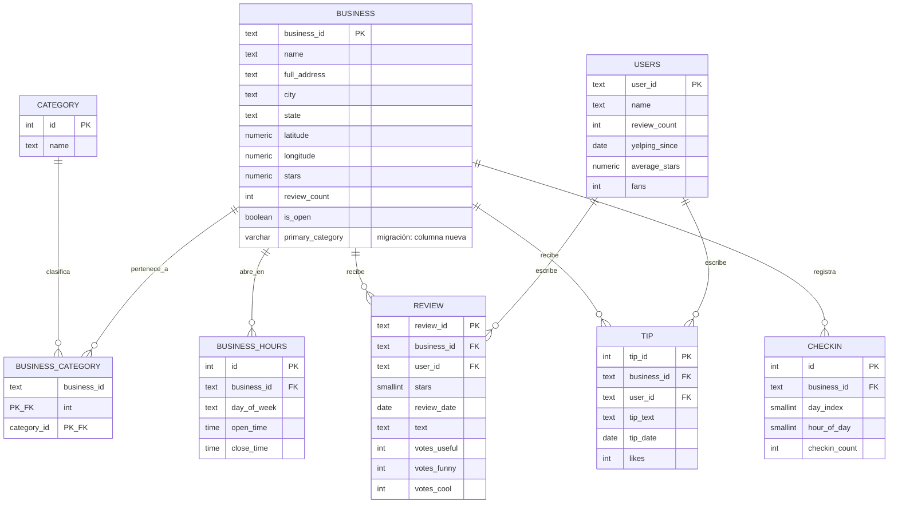

# Dominio de negocio — Reseñas de negocios locales (Goodyear, AZ)

## 1. Descripción del dominio

El modelo representa una **plataforma de reseñas de negocios locales**, inspirada en el
caso real de Yelp: negocios que pueden pertenecer a varias categorías (restaurante,
tienda, servicio de salud...), publican su horario de atención, y reciben **reseñas**
(calificación + texto) y **tips** (recomendaciones cortas, sin calificación) de parte
de **usuarios** registrados. Además, cada negocio acumula un historial agregado de
**check-ins**: cuántas visitas se registraron en cada franja de hora/día de la semana,
útil para entender patrones de afluencia.

A diferencia de Parch & Posey (una empresa que vende *a* cuentas corporativas a través
de representantes de ventas), este dominio es de **consumo masivo**: miles de usuarios
individuales interactúan libremente con cientos de negocios, sin jerarquía de ventas ni
territorios. La pregunta de negocio típica no es "¿qué representante vendió más?", sino
cosas como "¿qué categoría de negocio tiene mejor calificación promedio?", "¿en qué
franja horaria hay más afluencia?" o "¿qué negocios tienen reseñas pero ningún tip, o
viceversa?".

Los datos son una **muestra real acotada** del [Yelp Academic Dataset]: todos los
negocios de **Goodyear, AZ** (un suburbio de Phoenix, ~308 negocios) y únicamente las
reseñas, tips, check-ins y usuarios asociados a esos negocios — no el dataset completo
(que pesa ~1.3 GB y excede el tier gratuito de Neon). El proceso de extracción vive en
[`scripts/extraer_muestra.py`](../scripts/extraer_muestra.py) y se documenta en el
[`README`](../README.md).

## 2. Diagrama entidad-relación

El diagrama refleja el esquema **final**, después de aplicar el baseline y todas las
migraciones evolutivas de `sql_migrations/`. Las tablas marcadas como *(migración)*
no existen en el baseline: las crea una migración `V__` posterior — ver el detalle en
la sección 3.

## 3. Qué existe desde el baseline y qué llega por migración

| Tabla | Origen | Detalle |
|---|---|---|
| `category` | Baseline | Catálogo de categorías (192 en la muestra) |
| `business` | Baseline | Negocios de Goodyear, AZ (308) |
| `business_category` | Baseline | Relación N:N negocio↔categoría (870 filas) |
| `users` | Baseline | Usuarios autores de al menos una reseña o tip (2 757) |
| `review` | Baseline | Reseñas de esos negocios (4 978) |
| `business_hours` | Migración `V__` (tabla nueva) | Horario semanal por negocio (1 026 filas) |
| `business.primary_category` | Migración `V__` (columna nueva) | Categoría principal denormalizada — nace con un error de diseño (`VARCHAR(15)`), corregido por roll forward. Ver `docs/evidencias/`. |
| `tip` | Migración `V__` (tabla nueva) | Recomendaciones cortas (2 239 filas) |
| `checkin` | Migración `V__` (tabla nueva) | Check-ins agregados por hora/día (8 635 filas) |
| Índice + restricción sobre `review`/`business` | Migración `V__` | Ver `sql_migrations/` |

Volumen total de la muestra: **21 005 filas en 8 tablas**, muy por debajo del límite de
0.5 GB del tier gratuito de Neon.

[Yelp Academic Dataset]: https://www.yelp.com/dataset
