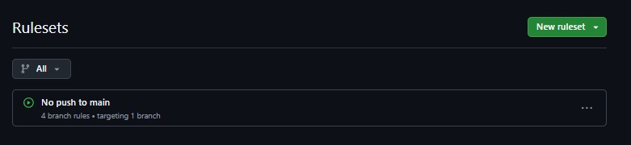
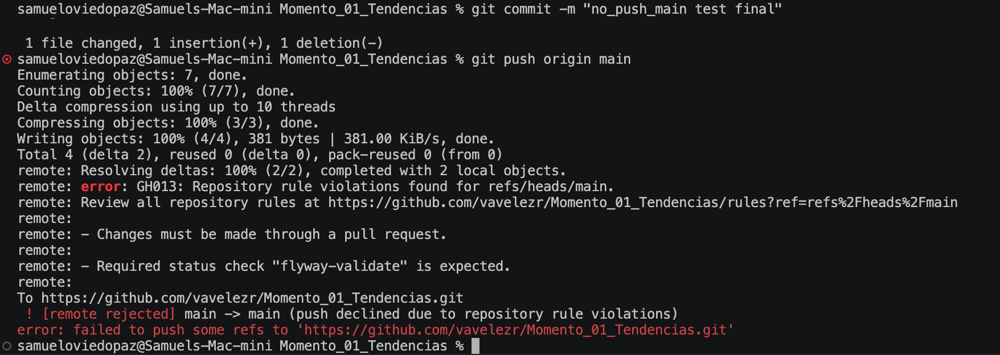
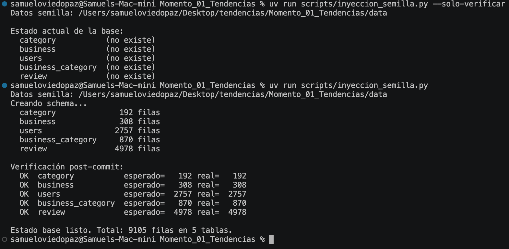
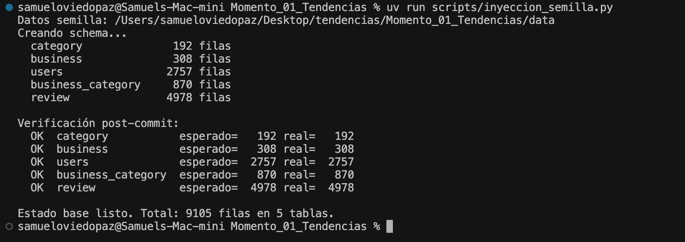

# Evidencias — Momento 1

Este documento reúne, en orden cronológico, la evidencia de que el pipeline de CI/CD sobre
la base de datos funciona como se decidió: **`main` protegida, cero push directo, todo
cambio vía Pull Request con un status check obligatorio**, y de que el estado base quedó
correctamente cargado en Neon. Se va llenando a medida que avanza cada fase del desarrollo —
cada sección nueva se agrega con sus capturas en [`images/`](images/).

---

## 1. Protección de la rama `main`

Regla creada en GitHub → *Settings → Rules → Rulesets*: **"No push to main"**, con 4 branch
rules aplicadas sobre la rama `main`.



**Qué prueba:** que la protección de rama no quedó solo documentada en el plan, sino
configurada y activa en el repositorio real.

### Verificación: intento de push directo, rechazado

Se intentó (a propósito, como prueba) un `git push origin main` directo, sin pasar por PR:



```text
remote: error: GH013: Repository rule violations found for refs/heads/main.
remote: - Changes must be made through a pull request.
remote: - Required status check "flyway-validate" is expected.
error: failed to push some refs to 'https://github.com/vavelezr/Momento_01_Tendencias.git'
```

**Qué prueba:**
- GitHub rechaza el push directo con el código `GH013`, exigiendo explícitamente un Pull
  Request — confirma la decisión técnica de `main` protegida, sin excepciones ni siquiera
  para administradores.
- El mensaje ya exige el status check `flyway-validate` como obligatorio, aunque el workflow
  que lo genera todavía no existe en el repo en este punto — la regla se configuró *antes*
  que el pipeline, a propósito.

---

## 2. Estado base cargado en Neon

Ejecución de [`scripts/inyeccion_semilla.py`](../../scripts/inyeccion_semilla.py) — crea el
schema baseline (`category`, `business`, `users`, `business_category`, `review`) y carga los
datos de [`data/`](../../data/): **9 105 filas en 5 tablas**.

### Carga en la branch `dev`

Primero `--solo-verificar` (las 5 tablas reportan "no existe"), luego la carga real:



```text
Estado base listo. Total: 9105 filas en 5 tablas.
```

Conteos por tabla, coincidentes con lo documentado en
[`docs/dominio_de_negocio.md`](../dominio_de_negocio.md): `category` 192, `business` 308,
`users` 2 757, `business_category` 870, `review` 4 978.

### Bootstrap único de la branch `main`

La misma carga, corrida **una sola vez** contra `main` — para que exista un schema que
Flyway pueda adoptar con `baseline` en la fase siguiente. A partir de aquí, `main` no vuelve
a recibir un script manual: solo cambia por pipeline.



**Qué prueba:** que ambas branches de Neon (`dev` y `main`) arrancan desde el mismo estado
base, con integridad verificada (conteos esperados = reales en las 5 tablas), antes de que
Flyway entre a gestionar el esquema.

---

## Pendiente de documentar (se agrega en cada fase siguiente)

- [ ] `flyway baseline` sobre `dev` y sobre `main` — Fase 2
- [ ] Workflow `flyway-validate-pr.yml` corriendo en un PR (éxito) — Fase 5
- [ ] Workflow `flyway-migrate.yml` corriendo tras un merge a `main` (éxito) — Fase 5
- [ ] Runs de las migraciones `V__`/`R__` — Fase 3–4
- [ ] Falla real por editar una migración ya aplicada (checksum mismatch en CI) — Fase 6
- [ ] Roll forward corregido y desplegado — Fase 6
