# Evidencias — Momento 1

Este documento reúne, en orden cronológico, la evidencia de que el pipeline de CI/CD sobre
la base de datos funciona como se decidió: **`main` protegida, cero push directo, todo
cambio vía Pull Request con un status check obligatorio**, y de que el estado base quedó
correctamente cargado en Neon. Se va llenando a medida que avanza cada fase del desarrollo —
cada sección nueva se agrega con sus capturas en [`images/`](images/).

---

## 1. Protección de la rama `main`

Regla creada en GitHub → *Settings → Rules → Rulesets*: **"No push to main"**, con 4 branch
rules aplicadas sobre la rama `main`.


**Qué prueba:** que la protección de rama no quedó solo documentada en el plan, sino
configurada y activa en el repositorio real.

### Verificación: intento de push directo, rechazado

Se intentó (a propósito, como prueba) un `git push origin main` directo, sin pasar por PR:


```text
remote: error: GH013: Repository rule violations found for refs/heads/main.
remote: - Changes must be made through a pull request.
remote: - Required status check "flyway-validate" is expected.
error: failed to push some refs to 'https://github.com/vavelezr/Momento_01_Tendencias.git'
```

**Qué prueba:**
- GitHub rechaza el push directo con el código `GH013`, exigiendo explícitamente un Pull
  Request — confirma la decisión técnica de `main` protegida, sin excepciones ni siquiera
  para administradores.
- El mensaje ya exige el status check `flyway-validate` como obligatorio, aunque el workflow
  que lo genera todavía no existe en el repo en este punto — la regla se configuró *antes*
  que el pipeline, a propósito.

---

## 2. Estado base cargado en Neon

Ejecución de [`scripts/inyeccion_semilla.py`](../../scripts/inyeccion_semilla.py) — crea el
schema baseline (`category`, `business`, `users`, `business_category`, `review`) y carga los
datos de [`data/`](../../data/): **9 105 filas en 5 tablas**.

### Carga en la branch `dev`

Primero `--solo-verificar` (las 5 tablas reportan "no existe"), luego la carga real:


```text
Estado base listo. Total: 9105 filas en 5 tablas.
```

Conteos por tabla, coincidentes con lo documentado en
[`docs/dominio_de_negocio.md`](../dominio_de_negocio.md): `category` 192, `business` 308,
`users` 2 757, `business_category` 870, `review` 4 978.

### Bootstrap único de la branch `main`

La misma carga, corrida **una sola vez** contra `main` — para que exista un schema que
Flyway pueda adoptar con `baseline` en la fase siguiente. A partir de aquí, `main` no vuelve
a recibir un script manual: solo cambia por pipeline.


**Qué prueba:** que ambas branches de Neon (`dev` y `main`) arrancan desde el mismo estado
base, con integridad verificada (conteos esperados = reales en las 5 tablas), antes de que
Flyway entre a gestionar el esquema.

---

## 3. Migraciones Flyway aplicadas: baseline + `V__` + `R__`

`flyway info` antes de aplicar la migración repetible, seguido de `flyway migrate`:

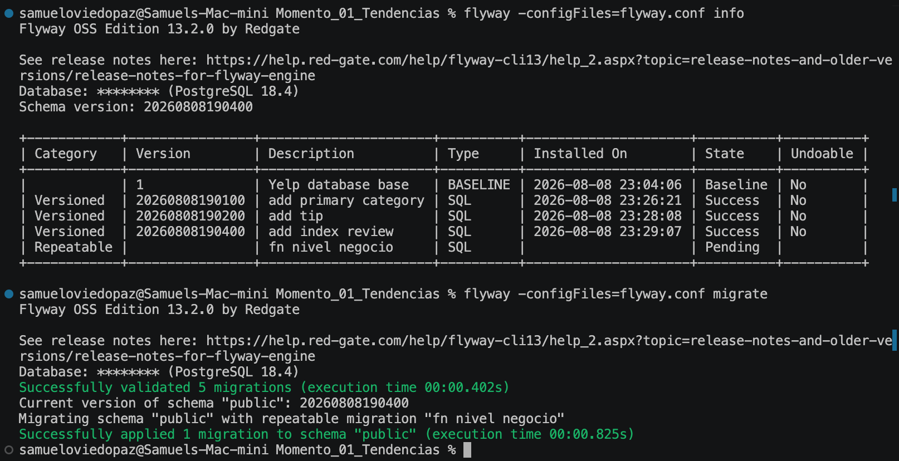

```text
Schema version: 20260808190400

 Category    | Version      | Description         | Type | State    |
 ------------|--------------|----------------------|------|----------|
             | 1            | Yelp database base   | BASELINE | Baseline |
 Versioned   | 20260808190100 | add primary category | SQL  | Success  |
 Versioned   | 20260808190200 | add tip              | SQL  | Success  |
 Versioned   | 20260808190400 | add index review     | SQL  | Success  |
 Repeatable  |              | fn nivel negocio     | SQL  | Pending  |

Successfully validated 5 migrations (execution time 00:00.402s)
Migrating schema "public" with repeatable migration "fn nivel negocio"
Successfully applied 1 migration to schema "public" (execution time 00:00.825s)
```

**Qué prueba:**
- El `baseline` (versión 1) y las 3 migraciones `V__` (`add_primary_category`, `add_tip`,
  `add_index_review`) están realmente aplicadas — no son solo archivos `.sql` en el repo sin
  ejecutar.
- `R__fn_nivel_negocio` pasa de `Pending` a aplicada tras el `migrate`, confirmando que
  Flyway detecta el archivo nuevo por checksum y lo corre sin necesitar una migración
  versionada aparte.
- `flyway validate` (parte de `migrate`) pasó sin errores sobre las 5 migraciones antes de
  aplicar nada — la misma puerta de calidad que se automatiza en el workflow de la Fase 5.

> Corrido localmente contra la branch `dev` de Neon, siguiendo la regla del proyecto: la
> terminal de un integrante nunca toca `main` directamente salvo el bootstrap único ya
> documentado en la sección 2. `main` recibirá estas mismas migraciones cuando exista el
> workflow de despliegue (Fase 5).

---

## 4. Primer run del workflow de despliegue: falla real de pipeline, diagnosticada y corregida

Al mergear el PR de la Fase 5, `Flyway Deploy` corrió por primera vez contra `main` — y
falló, como era esperable dado que `main` todavía no tenía el `baseline` corrido:

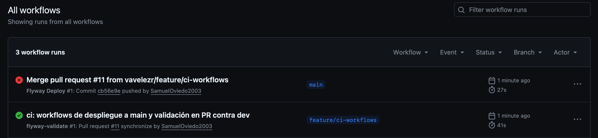

```text
Schema history table "public"."flyway_schema_history" does not exist yet
ERROR: Validate failed: Migrations have failed validation
Detected resolved migration not applied to database: 20260808190100.
To fix this error, either run migrate, or set -ignoreMigrationPatterns='*:pending'.
Detected resolved migration not applied to database: 20260808190200.
Detected resolved migration not applied to database: 20260808190400.
Detected resolved repeatable migration not applied to database: fn nivel negocio.
Error: Process completed with exit code 1.
```

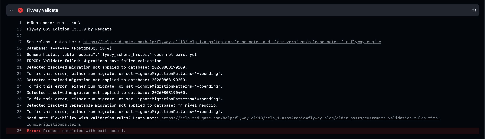

**Diagnóstico:** el paso `Flyway validate` de ambos workflows (`flyway-migrate.yml` y
`flyway-validate-pr.yml`) no tenía el flag `-ignoreMigrationPatterns='*:pending'` — que sí
está presente en la plantilla original del curso
(`data_ops_course_101/.github/workflows/flyway-migrate.yml`). Sin ese flag, `validate`
trata cualquier migración todavía no aplicada como un error, lo cual bloquea *cualquier*
deploy real (toda migración nueva es "pendiente" hasta que `migrate` la aplica un paso
después). Es un bug de configuración del pipeline, no del schema ni de los datos.

**Corrección (roll forward, no se edita el run que ya falló):** se agregó el flag faltante
a ambos workflows en una rama nueva (`fix/ci-validate-ignore-pending`). De paso, el equipo
revisó la decisión original de `flyway.conf.example` (baseline manual, sin
`baselineOnMigrate`) y decidió cambiarla **solo para los workflows de CI/CD**: ahora usan
`-baselineOnMigrate=true`, así que el siguiente deploy contra `main` se auto-baselinea sin
necesitar el paso manual que se había documentado antes. El uso local sigue siendo manual
(`flyway.conf` no fija ese flag) — la decisión y su alternativa descartada quedan
documentadas en el comentario de [`flyway-migrate.yml`](../../.github/workflows/flyway-migrate.yml).

**Qué prueba:** que el pipeline realmente se ejecuta contra Neon (no es un mock), que
`flyway validate` sí actúa como puerta de calidad real (bloqueó el deploy en vez de dejarlo
pasar a medias), y que el equipo puede diagnosticar y corregir un fallo de CI real con
evidencia trazable en GitHub Actions — el mismo patrón que se usará en la Fase 6 para el
error de diseño intencional en `primary_category`.

---

## 5. Fase 6 — Falla real de diseño y roll forward

`business.primary_category` se agregó en la Fase 3 como `VARCHAR(15)`. No es un typo de
sintaxis: es un error de diseño real — la muestra tiene 50 de sus 192 categorías (26%) con
más de 15 caracteres, así que la columna falla con datos legítimos del propio dataset.

### 5.1 El error, con datos reales

SQL Editor de Neon, sobre `dev`:

```sql
UPDATE business SET primary_category = 'Health & Medical'
WHERE business_id = '8iknYh-EMVCWAlzVtOYScw';
```

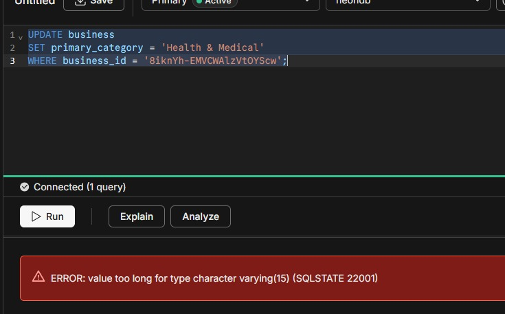

```text
ERROR: value too long for type character varying(15) (SQLSTATE 22001)
```

### 5.2 La tentación: editar la migración ya aplicada

Rama `feature/wrong-fix-editar-migracion-vieja` (PR #13): cambia `VARCHAR(15)` por
`VARCHAR(100)` directamente en `V20260808190100__add_primary_category.sql` — el archivo
que Flyway ya aplicó, con su checksum ya grabado en `flyway_schema_history` de `dev` y de
`main`. Se reproduce primero en local, contra `dev`:

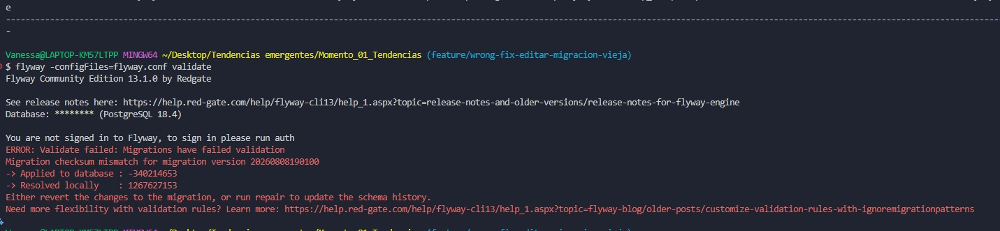

Y el mismo fallo en el PR real, en GitHub Actions:

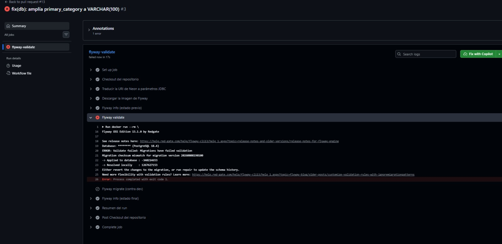

```text
ERROR: Validate failed: Migrations have failed validation
Migration checksum mismatch for migration version 20260808190100
 -> Applied to database : -340214653
 -> Resolved locally    : 1267627153
```

**Qué prueba:** el ruleset de `main` exige `flyway-validate` en verde y no permite bypass
ni a administradores — este PR queda bloqueado sin posibilidad de mergear, exactamente lo
que se decidió en la Fase 1. El PR se cerró sin mergear y la rama se descartó.

### 5.3 El roll forward real

Rama `feature/fix-primary-category-length` (PR #14): migración **nueva**
`V20260808200000__fix_primary_category_length.sql`:

```sql
ALTER TABLE business ALTER COLUMN primary_category TYPE VARCHAR(100);
```

Validada y aplicada primero en local, contra `dev`:

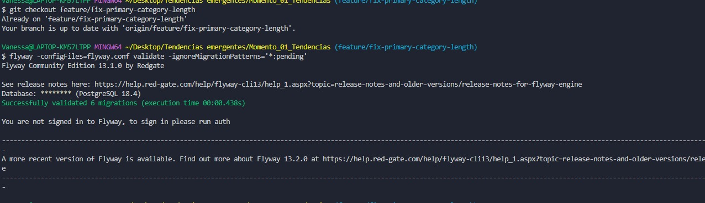
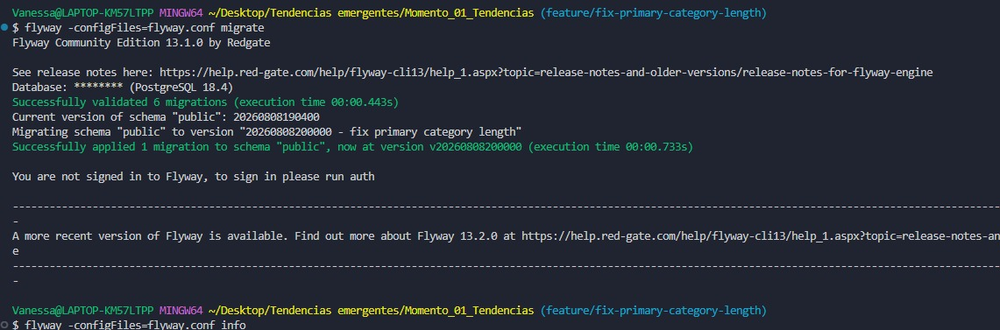

Al ser un archivo nuevo, no toca ningún checksum existente: `flyway-validate` pasó en el
PR y se mergeó a `main`, donde `Flyway Deploy` aplicó el `ALTER TABLE`. Verificación
funcional sobre `main`, con la misma consulta que antes fallaba:

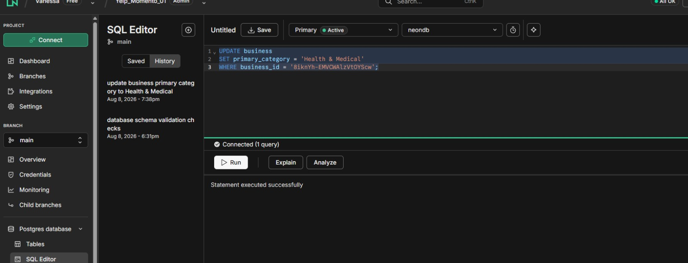

**Qué prueba:** el error de diseño se corrige con una migración nueva, nunca editando una
ya aplicada — y el mismo pipeline que bloqueó el PR #13 dejó pasar el #14 sin fricción
porque no había ningún checksum en conflicto.

---

---

# Momento 2 — Ingesta hacia Snowflake

Arranca aquí la evidencia del Momento 2 (Cloud DW e ingesta), sobre el mismo dominio y
la misma branch `dev` de Neon del Momento 1.

## Sesión 4 adaptada — primera carga ELT (Neon → Snowflake RAW)

Aprovisionamiento de Snowflake como código en [`snowflake/setup/`](../../snowflake/setup/)
(base de datos `YELP_GOODYEAR_DW`, warehouse `WH_YELP_XS` con auto-suspend, rol de
servicio `YELP_LOADER_ROLE` sin privilegios de administración, usuario `SVC_YELP_LOADER`
autenticado por par de llaves RSA — `TYPE = SERVICE`, sin password, para evitar el MFA
obligatorio que Snowflake exige en login interactivo). Extracción y carga con
[`ingesta/elt_neon_to_snowflake.py`](../../ingesta/elt_neon_to_snowflake.py):

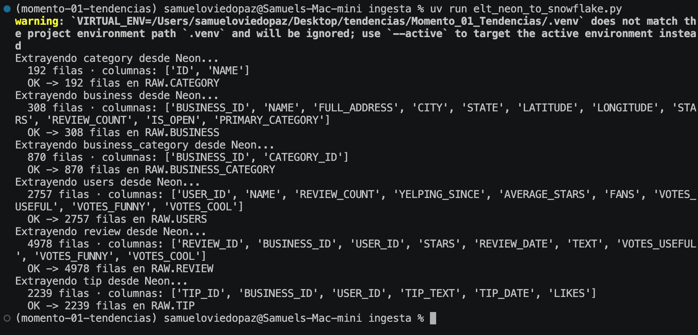

```text
Extrayendo category desde Neon...          192 filas  ->  OK -> 192 filas en RAW.CATEGORY
Extrayendo business desde Neon...          308 filas  ->  OK -> 308 filas en RAW.BUSINESS
Extrayendo business_category desde Neon... 870 filas  ->  OK -> 870 filas en RAW.BUSINESS_CATEGORY
Extrayendo users desde Neon...            2757 filas  ->  OK -> 2757 filas en RAW.USERS
Extrayendo review desde Neon...           4978 filas  ->  OK -> 4978 filas en RAW.REVIEW
Extrayendo tip desde Neon...              2239 filas  ->  OK -> 2239 filas en RAW.TIP
```

**Qué prueba:**
- Las 6 tablas del modelo propio (baseline + `tip` del Momento 1) llegan completas a
  Snowflake — 11 344 filas en total, el mismo número documentado en
  [`docs/dominio_de_negocio.md`](../dominio_de_negocio.md).
- La autenticación por par de llaves funciona de punta a punta: `SVC_YELP_LOADER` es un
  usuario de servicio **compartido por el equipo**, cada integrante con su propia llave
  registrada en un slot distinto (`RSA_PUBLIC_KEY` / `RSA_PUBLIC_KEY_2`) — documentado en
  [`snowflake/setup/05_set_service_user_key.sql`](../../snowflake/setup/05_set_service_user_key.sql).
- El script resuelve `SNOWFLAKE_PRIVATE_KEY_PATH` anclándose en la raíz del repositorio
  (no en el directorio desde donde se invoca) — mismo patrón que
  [`scripts/inyeccion_semilla.py`](../../scripts/inyeccion_semilla.py) usa para `data/`.

**Qué falta todavía** (fuera del alcance de esta primera carga, ver
[`ingesta/README.md`](../../ingesta/README.md)): Internal Stages (`PUT` + `COPY INTO`),
idempotencia real, bitácora de carga y validaciones automatizadas — contenido de la
Sesión 5 y del resto de la rúbrica del Momento 2.

## Schema drift: detectado y corregido con roll forward

`review.sentiment_label` se agregó como columna **permanente** del modelo vía migración
Flyway ([`V20260815154746__add_review_sentiment_label.sql`](../../sql_migrations/V20260815154746__add_review_sentiment_label.sql)),
con el mismo flujo PR + `flyway-validate` + merge + `flyway-migrate` de siempre — no un
`ALTER` suelto por fuera del pipeline. Aun así, Snowflake `RAW` no se entera de columnas
nuevas hasta que algo las carga: es exactamente el escenario de schema drift que la
ingesta debe manejar sin caerse a medias.

### El drift, detectado antes de tocar Snowflake

```bash
cd ingesta
uv run elt_neon_to_snowflake.py --tabla review
```

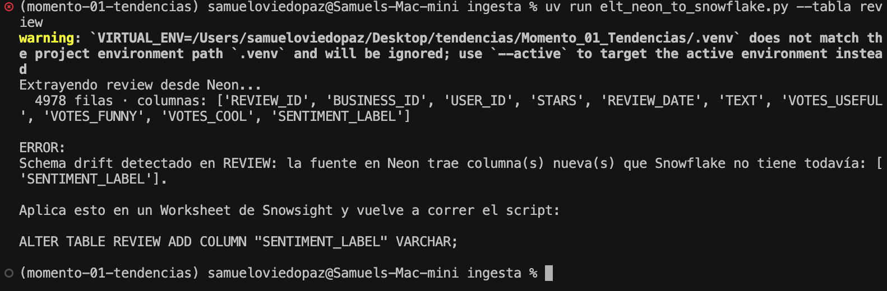

```text
Extrayendo review desde Neon...
  4978 filas · columnas: [..., 'SENTIMENT_LABEL']

ERROR:
Schema drift detectado en REVIEW: la fuente en Neon trae columna(s) nueva(s) que
Snowflake no tiene todavía: ['SENTIMENT_LABEL'].

Aplica esto en un Worksheet de Snowsight y vuelve a correr el script:

ALTER TABLE REVIEW ADD COLUMN "SENTIMENT_LABEL" VARCHAR;
```

### Roll forward en Snowflake y recarga exitosa

```sql
USE ROLE YELP_LOADER_ROLE;  -- dueño real de la tabla; ACCOUNTADMIN no hereda MODIFY sobre objetos que no creó
USE DATABASE YELP_GOODYEAR_DW;
USE SCHEMA RAW;
ALTER TABLE REVIEW ADD COLUMN "SENTIMENT_LABEL" VARCHAR;
```

```bash
uv run elt_neon_to_snowflake.py --tabla review
```

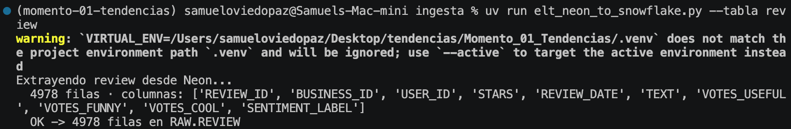

```text
OK -> 4978 filas en RAW.REVIEW
```

**Qué prueba:**
- El pipeline detecta un cambio de schema en el origen **antes** de escribir nada mal en
  el destino — el mismo criterio de "detectar antes de fallar" que ya se demostró con
  Flyway (`flyway validate` antes de `migrate`) en el Momento 1.
- El DDL que corrige el drift lo genera el propio script, no alguien adivinando — y se
  aplica manualmente en Snowflake, nunca automático, mismo principio que "generar el DDL,
  no ejecutarlo solo" del rol de servicio sin privilegios de administración.
- Detalle operativo real, no solo de script: `YELP_LOADER_ROLE` es el dueño de las tablas
  de `RAW` (las creó él), así que un usuario humano con `ACCOUNTADMIN` necesita activar
  ese rol explícitamente para poder alterarlas — Snowflake no da privilegios implícitos
  por estar arriba en la jerarquía.

---

## Pendiente de documentar (Momento 1)

- [x] `flyway baseline` sobre `dev` — sección 3
- [x] `flyway baseline` sobre `main` — automático vía `-baselineOnMigrate=true` (sección 4)
- [x] Workflow `flyway-validate-pr.yml` corriendo en un PR (éxito) — sección 4
- [x] Workflow `flyway-migrate.yml` corriendo tras un merge a `main` (fallo real, diagnosticado) — sección 4
- [x] Runs de las migraciones `V__`/`R__` contra `dev` — sección 3
- [x] Runs de las migraciones `V__`/`R__` contra `main` (vía pipeline) — merge de los PR #6-#14, verificado funcionalmente en 5.3
- [x] Falla real por un error de diseño (no de pipeline) + roll forward — sección 5
- [x] Roll forward de `primary_category` corregido y desplegado — sección 5

---

## Sesión 5 — Ingesta semi-estructurada, DAG de Tasks, RBAC + Masking

Cierra los Puntos 3, 4 y 5 del Momento 2 sobre la segunda fuente elegida: horario semanal
por negocio, agrupado en un array anidado (`weekly_hours`) a partir de
`data/business_hours.json` — ver [`docs/dominio_de_negocio.md`](../dominio_de_negocio.md).
Scripts versionados en [`snowflake/json/`](../../snowflake/json/) (ver su
[`README.md`](../../snowflake/json/README.md) para el orden de ejecución completo);
exports generados por
[`scripts/generar_export_business_hours.py`](../../scripts/generar_export_business_hours.py)
(`business_hours_export_1.json` / `_2.json`, 77 negocios cada uno).

### 1. Ingesta semi-estructurada (Punto 3): Internal Stage + `VARIANT` + `FLATTEN`

Script: [`snowflake/json/01_setup_stage_and_raw.sql`](../../snowflake/json/01_setup_stage_and_raw.sql)
(file format `STRIP_OUTER_ARRAY = TRUE`, stage interno, tabla `RAW_BUSINESS_HOURS`,
`COPY INTO`) + [`02_flatten_query_exploration.sql`](../../snowflake/json/02_flatten_query_exploration.sql)
(`LATERAL FLATTEN` y materialización en `STAGING.STG_BUSINESS_HOURS_FLATTENED`).

Subida de los dos archivos al stage (Snowsight → *Upload Your Files*, equivalente a `PUT`
desde SnowSQL):

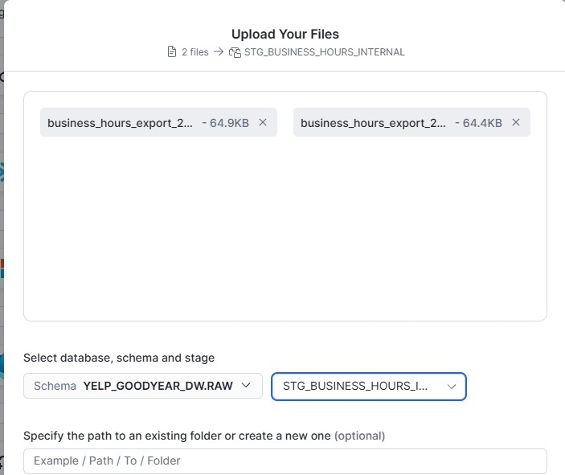

Vista previa del contenido crudo del stage, antes de cargarlo a una tabla — confirma que
`weekly_hours` llega como array anidado real, no un JSON plano:

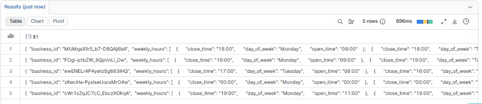

**Qué prueba:** el archivo en el stage ya trae, por fila, un objeto con un array anidado
(`weekly_hours`) — es la condición mínima que exige la rúbrica para "Excelente" en este
punto (no basta un JSON plano sin nada que aplanar).

Conteo post-`COPY INTO` y post-`FLATTEN`:

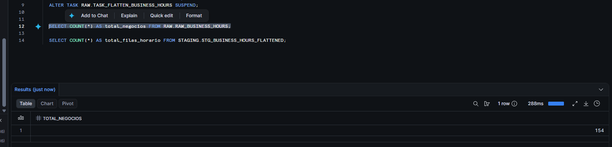

```text
TOTAL_NEGOCIOS: 154
```

**Qué prueba:** los 154 negocios del export (77 + 77 de los dos archivos) llegaron
completos a `RAW_BUSINESS_HOURS` — el `COPY INTO` no perdió ni duplicó filas.

Negocios con menos de 7 días de horario reportado:

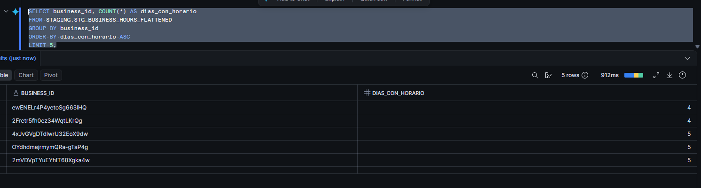

**Qué prueba:** el `FLATTEN` desenrolló el array `weekly_hours` completo por negocio, no
solo la primera posición — hay negocios con 4 y 5 días registrados (no los 7 parejos),
lo que confirma que la cantidad de filas por negocio varía según lo que de verdad traía
cada array, no según un número fijo asumido por el script.

### 2. Orquestación con Tasks (Punto 4): DAG raíz → hija

Script: [`snowflake/json/03_tasks_and_dag_management.sql`](../../snowflake/json/03_tasks_and_dag_management.sql) —
DAG de dos tareas (`TASK_INGEST_BUSINESS_HOURS`, raíz con `SCHEDULE`;
`TASK_FLATTEN_BUSINESS_HOURS`, hija con `AFTER`), activado con
`SYSTEM$TASK_DEPENDENTS_ENABLE`, disparado con `EXECUTE TASK`.

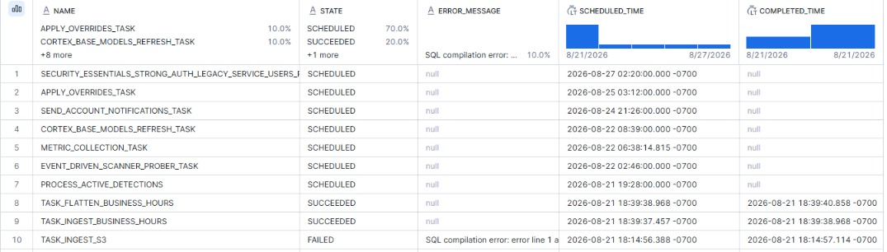

**Qué prueba:** `TASK_INGEST_BUSINESS_HOURS` completó a las 18:39:37 y
`TASK_FLATTEN_BUSINESS_HOURS` a las 18:39:38 — la hija se disparó sola por la dependencia
`AFTER` un segundo después de que la raíz terminó, sin que nadie ejecutara la segunda tarea
a mano. (`TASK_HISTORY()` sin filtro devuelve además tareas de sistema de la propia cuenta
de Snowflake — `CORTEX_BASE_MODELS_REFRESH_TASK`, `APPLY_OVERRIDES_TASK`, etc., no son del
proyecto; el script ya filtra por `WHERE name IN (...)` para que la próxima captura salga
limpia sin tener que recortarla.)

**Administración: tocar la hija con la raíz activa falla, en cualquier dirección.**
Con `TASK_INGEST_BUSINESS_HOURS` (raíz) ya `RESUME`d y activa, se intentó tanto
reanudar como suspender la hija directamente:

```sql
ALTER TASK RAW.TASK_INGEST_BUSINESS_HOURS RESUME;
ALTER TASK RAW.TASK_FLATTEN_BUSINESS_HOURS RESUME;  -- falla
```

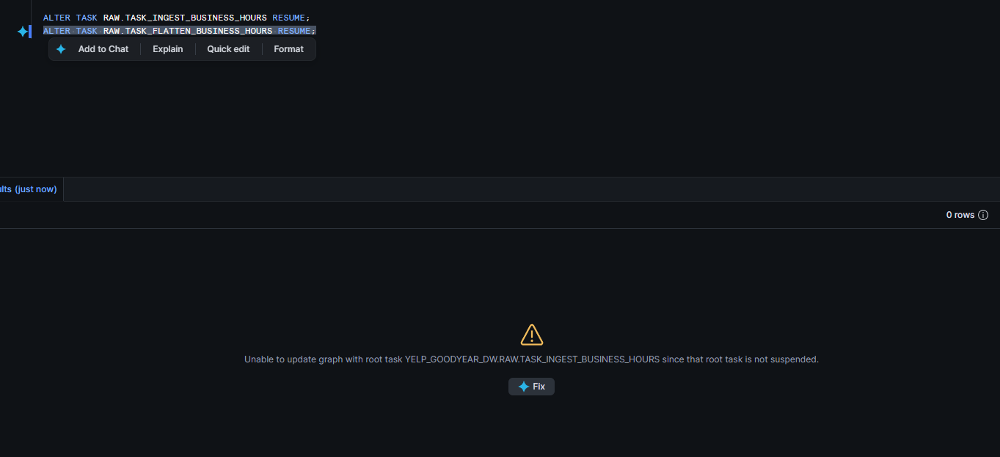

```sql
ALTER TASK RAW.TASK_INGEST_BUSINESS_HOURS RESUME;
ALTER TASK RAW.TASK_FLATTEN_BUSINESS_HOURS SUSPEND;  -- también falla
```

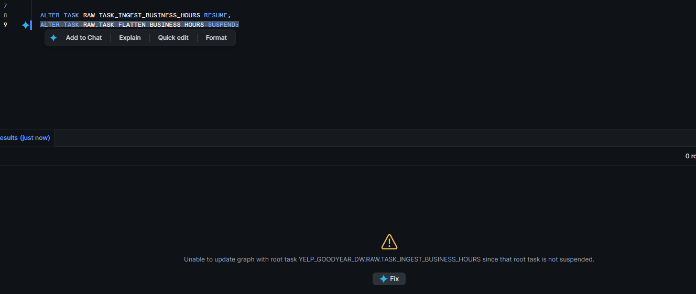

```text
Unable to update graph with root task YELP_GOODYEAR_DW.RAW.TASK_INGEST_BUSINESS_HOURS
since that root task is not suspended.
```

**Qué prueba:** el error real que devuelve Snowflake no es el código 091421 que
esperábamos por el material de clase, sino este mensaje — pero es exactamente la misma
regla: **ningún miembro de un DAG se puede alterar (ni `RESUME` ni `SUSPEND`) mientras la
raíz esté activa**. Solo se puede tocar un hijo con la raíz ya `SUSPEND`ed, o dejar que
`SYSTEM$TASK_DEPENDENTS_ENABLE`/`EXECUTE TASK` gestionen el árbol completo. Es evidencia
de haber entendido la regla (y de haberla probado en los dos sentidos), no solo de
citarla.

> ⚠️ **Pendiente, sin resolver a propósito:** el `SHOW TASKS` con ambas tareas en
> `started` justo después de `SYSTEM$TASK_DEPENDENTS_ENABLE` no tiene captura. Se decidió
> dejarlo así — no es bloqueante: `TASK_HISTORY` ya prueba que ambas tareas corrieron y
> `SUCCEEDED`, que es la evidencia de que el DAG sí estuvo activo.

### 3. RBAC + Masking Policy (Punto 5): visibilidad diferenciada por rol

Script: [`snowflake/json/04_rbac_and_masking.sql`](../../snowflake/json/04_rbac_and_masking.sql) —
roles `ROLE_YELP_DATA_ANALYST` (todo el dato) y `ROLE_YELP_BUSINESS_OWNER` (dato operativo,
PII enmascarada), Masking Policy sobre `USERS.NAME` (único campo de PII del dominio).

> **Sobre el "antes":** el script incluye el `SELECT` con ambos roles de negocio antes de
> crear la masking policy, pero no quedó capturado — la política ya estaba aplicada para
> cuando se tomaron las evidencias, y revertirla (`UNSET MASKING POLICY`) solo para la
> foto habría alterado el estado ya validado del pipeline. Se decidió no perseguir esta
> captura: la rúbrica (`C5 Excelente`, ver `snowflake/json/README.md`) exige mostrar la
> **visibilidad diferenciada por rol** — el "después" de abajo — no un contraste explícito
> de dos estados; el "antes" era refuerzo nuestro, no un requisito literal.

**Después de aplicar la política:** mismo `SELECT`, tres roles, tres resultados distintos:

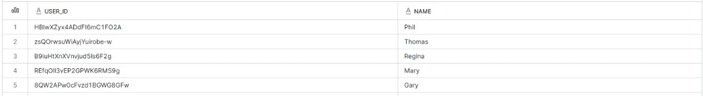

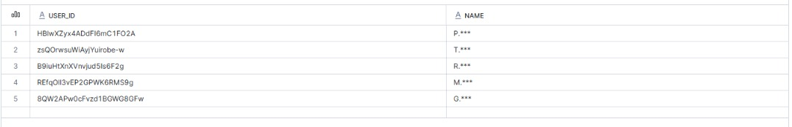

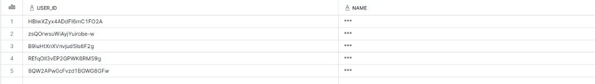

**Qué prueba:** el mismo `SELECT` sobre la misma tabla devuelve tres resultados distintos
según el rol activo — la definición misma de "visibilidad diferenciada por rol" que pide
`C5 Excelente`. `ACCOUNTADMIN` cae en la rama `ELSE` de la política (no es ninguno de los
dos roles de negocio), así que ve el nombre igual de enmascarado que un rol sin privilegio
explícito — mostrando que la política protege el dato incluso del rol administrativo si no
se le da una excepción a propósito.

### Checklist de evidencia — Sesión 5

- [x] `COPY INTO` cargando el JSON semi-estructurado, con array anidado real (`weekly_hours`).
- [x] Conteo de filas post-`COPY INTO` (154 negocios) y post-`FLATTEN` (variabilidad real
      de días por negocio, 4-5 en los casos más bajos).
- [x] DAG con `EXECUTE TASK` disparado manualmente y `TASK_HISTORY` mostrando la corrida
      exitosa de ambas tareas.
- [ ] `SHOW TASKS` con el DAG en `started` tras `SYSTEM$TASK_DEPENDENTS_ENABLE` — **sin
      capturar, a propósito** (no bloqueante: `TASK_HISTORY` ya prueba que el DAG corrió).
- [x] Intento de tocar la hija con la raíz activa → error real de Snowflake, en las dos
      direcciones (`RESUME` y `SUSPEND`). El mensaje real difiere del 091421 citado en
      clase, pero es la misma regla de administración.
- [x] Visibilidad diferenciada por rol después de aplicar la Masking Policy (3 roles, 3
      resultados distintos).
- [ ] Visibilidad *antes* de aplicar la Masking Policy — **no capturada, a propósito**
      (no es un requisito literal de la rúbrica; ver nota en la sección 3).

---

# Momento 3 — Transformación con dbt (arquitectura Medallón)

Proyecto dbt en [`dbt/`](../../dbt/) sobre `YELP_GOODYEAR_DW`: `staging/` (Silver, 7
vistas) → `core/` (Gold, 2 tablas). Detalle de diseño en
[`dbt/README.md`](../../dbt/README.md).

## Silver: 7 vistas + tests, corridos contra Snowflake real

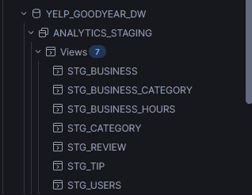

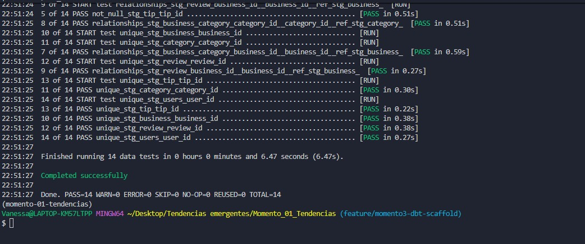

**Qué prueba:** las vistas de staging no son solo archivos `.sql` sin correr — están
creadas de verdad en Snowflake, con sus tests genéricos (`unique`, `not_null`,
`relationships`, `accepted_values`) pasando contra los datos reales.

## Gold: 2 modelos, uno cruzando dos orígenes de datos

- `dim_business_reputation` (308 filas) — reputación del negocio, misma regla que
  `R__fn_nivel_negocio.sql` del Momento 1.
- `fct_business_hours_performance` (154 filas) — cruza el horario semi-estructurado
  (Sesión 5) con las reseñas relacionales (Momento 1): ¿más horas de atención implican
  más o mejores reseñas?

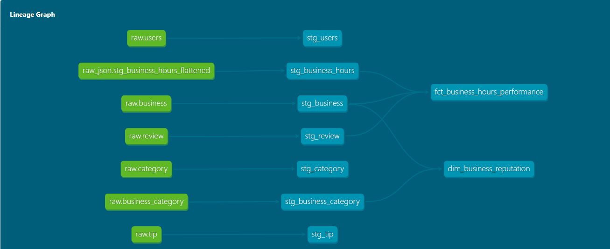

**Qué prueba:** el lineage completo, sin modelos sueltos — todo Gold llega desde Silver
vía `ref()`, nunca tocando una fuente cruda directamente.

## Automatización: GitHub Actions

Workflow [`dbt_build.yml`](../../.github/workflows/dbt_build.yml) — corre `dbt build`
contra Snowflake con autenticación por llave RSA (Secrets del repositorio). Ya tiene una
ejecución real y exitosa registrada (disparada por el merge del PR #26 a `main`, ~41s,
success).

## Checklist rápido — Momento 3

- [x] `dbt build` corre limpio (Silver + Gold, 31/31).
- [x] Modelos Gold solo usan `ref()`, nunca `source()` directo.
- [x] Modelo Gold que cruza dos orígenes de datos distintos.
- [x] ≥2 tests de `dbt_expectations`, justificados con razón de negocio.
- [x] Lineage completo, sin modelos huérfanos.
- [x] Workflow de GitHub Actions con ≥1 corrida real exitosa.
- [x] `profiles.yml.example` y `.env.example` sin credenciales reales.
